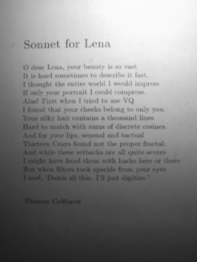
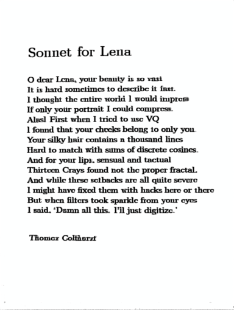

# Denoisy UNet - Image Restoration using UNet

A PyTorch implementation of image restoration using UNet architecture for denoising and quality enhancement of traditional/degraded images.

## 📋 Overview

This project implements a UNet-based image restoration model that can:
- Remove noise from degraded images
- Enhance traditional image quality
- Restore images using paired training data

The model uses a combination of L1 loss, SSIM loss, and edge-preserving loss for optimal image restoration.

## 🏗️ Architecture

### UNet Model
- **Encoder**: Two downsampling blocks (64, 128 channels)
- **Bottleneck**: 256 channels
- **Decoder**: Two upsampling blocks with skip connections
- **Output**: RGB image (3 channels)

### Loss Function
The model uses a combined loss function:
- **L1 Loss**: Pixel-wise reconstruction
- **SSIM Loss**: Structural similarity preservation
- **Edge Loss**: Edge-preserving using Sobel filters

## 📁 Project Structure

```
denoisy_unet/
├── conf.yaml           # Configuration file
├── dataset.py          # Dataset class for paired images
├── model.py           # UNet model architecture
├── train.py           # Training script
├── infer.py           # Inference script
├── requirements.txt   # Python dependencies
├── data/             # Dataset directory
│   ├── clean/        # Clean/target images
│   ├── trad/         # Traditional/input images
│   ├── noisy/        # Noisy images
│   └── no_b/         # Additional data
├── ckpt_bi/          # Checkpoints with bi-directional training
├── ckpt_nobi/        # Checkpoints without bi-directional training
└── result/           # Inference results
    ├── origin/       # Original input images
    ├── fixed/        # Fixed output images
    └── fixed_1/      # Additional fixed results
```

## ⚙️ Installation

1. Clone the repository:
```bash
git clone https://github.com/W-X-Dai/text_recovery.git
cd denoisy_unet
```

2. Install dependencies:
```bash
pip install -r requirements.txt
```

### Requirements
- Python 3.8+
- PyTorch 2.8.0
- torchvision 0.23.0
- PIL (Pillow) 11.3.0
- PyYAML 6.0.2
- pytorch-msssim 1.0.0
- torch-fidelity 0.3.0
- tqdm 4.67.1
- numpy 2.2.6

## 🚀 Usage

### Configuration

Edit `conf.yaml` to configure your training and inference settings:

```yaml
data:
  clean_dir: "data/clean"      # Path to clean images
  trad_dir: "data/trad"        # Path to traditional/input images
  image_size: 256              # Image size for training

train:
  batch_size: 8                # Training batch size
  lr: 0.0001                  # Learning rate
  epochs: 100                 # Number of training epochs
  save_every: 5               # Save checkpoint every N epochs
  save_path: "ckpt_nobi"      # Checkpoint save directory

infer:
  input_dir: "result/origin"   # Input images for inference
  output_dir: "result/fixed_1" # Output directory
  ckpt: "ckpt_nobi/checkpoint_epoch100.pth"  # Model checkpoint
  keep_original_size: true     # Preserve original image size
  keep_trad_suffix: false     # Keep "_trad" suffix in output names
```

### Training

To train the model:

```bash
python train.py
```

The training script will:
- Load paired images from `clean` and `trad` directories
- Train the UNet model with combined loss
- Save checkpoints every 5 epochs
- Generate sample outputs during training

### Inference

To run inference on new images:

```bash
python infer.py
```

Make sure to:
1. Place input images in the directory specified by `infer.input_dir`
2. Set the correct checkpoint path in `conf.yaml`
3. Specify the output directory

## 📊 Model Performance

The model is trained with:
- **Combined Loss**: L1 + 0.5×SSIM + 0.5×Edge Loss
- **Optimizer**: Adam with learning rate 1e-4
- **Batch Size**: 8
- **Image Size**: 256×256

Checkpoints are saved every 5 epochs up to 100 epochs, allowing you to choose the best performing model.

## 🔧 Data Preparation

### Dataset Structure
Organize your data as follows:
```
data/
├── clean/    # High-quality target images
│   ├── image1.png
│   ├── image2.png
│   └── ...
└── trad/     # Degraded/traditional input images
    ├── image1.png
    ├── image2.png
    └── ...
```

### Image Requirements
- Format: PNG, JPG, or other PIL-supported formats
- Resolution: Any (will be resized to 256×256 during training)
- Channels: RGB (3 channels)

## 📈 Results

The model generates restored images with:
- Reduced noise and artifacts
- Enhanced structural details
- Preserved edge information
- Improved overall image quality

Results are saved in the specified output directory with optional filename suffix handling.

Following is the original input image:



And here is the restored output image:



## 🤝 Contributing

1. Fork the repository
2. Create a feature branch
3. Commit your changes
4. Push to the branch
5. Create a Pull Request

## 📄 License

This project is part of the text_recovery repository by W-X-Dai.

## 🔗 Repository

- **Repository**: [text_recovery](https://github.com/W-X-Dai/text_recovery)
- **Owner**: W-X-Dai
- **Branch**: main